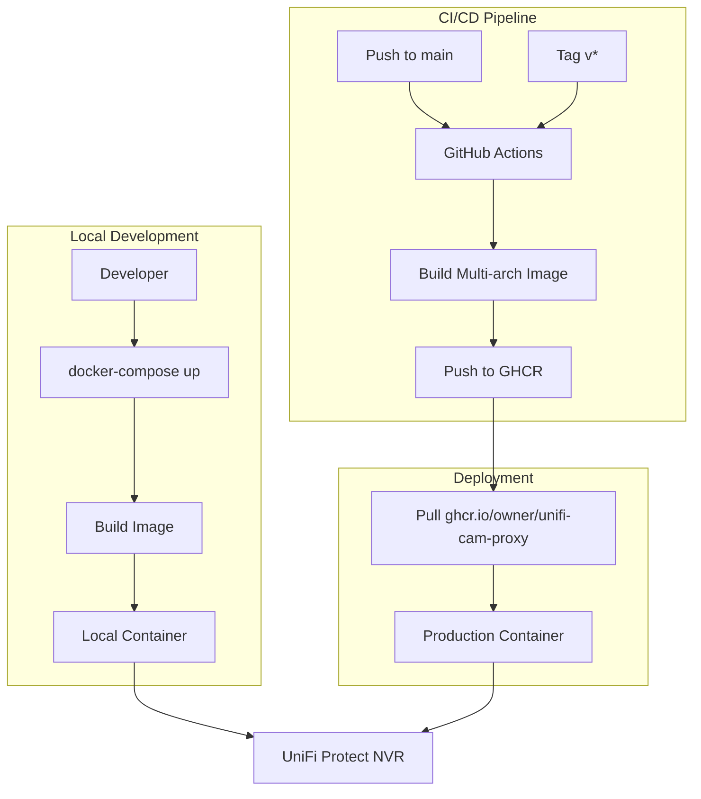

# Build Process Analysis & Simplification Plan

## Executive Summary

This document provides a comprehensive analysis of the current build process for the `unifi-cam-proxy` project and recommends simplifications while maintaining GHCR publishing capability.

---

## Current State Analysis

### 1. Dockerfile Analysis

**File**: [`Dockerfile`](Dockerfile)

#### Current Implementation
```dockerfile
ARG version=3.9
ARG tag=${version}-slim-bookworm

FROM python:${tag} AS builder
# Builder stage with cargo, rustc, gcc, g++ for native extensions

FROM python:${tag}
# Runtime stage copying site-packages from builder
```

#### Issues Identified

| Issue | Severity | Description |
|-------|----------|-------------|
| **Missing package config** | 🔴 Critical | Line 40 runs `pip install .` but no `setup.py` or `pyproject.toml` exists |
| Redundant pip install | 🟡 Medium | Packages already installed in builder and copied - line 40 is unnecessary |
| Duplicate COPY | 🟢 Low | `COPY . .` (line 39) already copies entrypoint.sh, making line 42 redundant |
| Build arg complexity | 🟢 Low | ARG indirection (`version` → `tag`) adds minimal value |
| Missing healthcheck | 🟢 Low | No HEALTHCHECK instruction for container orchestration |

#### What Works Well
- ✅ Multi-stage build pattern reduces final image size
- ✅ Using slim-bookworm variant (minimal Debian)
- ✅ Proper layer ordering (dependencies before source)
- ✅ Cleaning apt cache with `rm -rf /var/lib/apt/lists/*`

---

### 2. docker-compose.yaml Analysis

**File**: [`docker-compose.yaml`](docker-compose.yaml)

#### Current Implementation
```yaml
version: '3'
services:
  unifi-cam-proxy:
    # ... configuration ...
  unifi-protect:
    # Full UniFi Protect container for local testing
```

#### Issues Identified

| Issue | Severity | Description |
|-------|----------|-------------|
| Deprecated version key | 🟢 Low | `version: '3'` is deprecated in Compose V2 |
| Complexity for users | 🟡 Medium | Includes full unifi-protect container most users don't need |
| Hardcoded values | 🟡 Medium | Environment variables have hardcoded example values |
| Missing profiles | 🟡 Medium | No way to optionally exclude unifi-protect |

#### What Works Well
- ✅ Proper volume mounting for client.pem
- ✅ Restart policy configured
- ✅ Service dependencies defined

---

### 3. GitHub Actions Workflow Analysis

**File**: [`.github/workflows/image.yml`](.github/workflows/image.yml)

#### Current Implementation
- Manual tag preparation with shell script
- Builds only for `linux/amd64`
- Uses older action versions

#### Issues Identified

| Issue | Severity | Description |
|-------|----------|-------------|
| Outdated actions | 🟡 Medium | Using v2/v3/v4 actions (current: v5+) |
| Manual tag logic | 🟡 Medium | Complex shell script for tagging could use `docker/metadata-action` |
| No build caching | 🟡 Medium | Missing GitHub Actions cache for faster builds |
| Single platform | 🟡 Medium | Only builds `linux/amd64` - no ARM support |
| No vulnerability scanning | 🟢 Low | Missing security scan step |

#### What Works Well
- ✅ Proper GHCR authentication
- ✅ Supports both branch pushes and tags
- ✅ Includes OCI labels for provenance

---

### 4. requirements.txt Analysis

**File**: [`requirements.txt`](requirements.txt)

#### Current Dependencies
```
aiohttp
backoff
coloredlogs
flvlib3@https://github.com/zkonge/flvlib3/archive/master.zip
packaging
pydantic<2.0
pyunifiprotect @ https://github.com/bdraco/pyunifiprotect/archive/refs/heads/master.zip
reolinkapi
websockets>=9.0.1,<13.0
```

#### Issues Identified

| Issue | Severity | Description |
|-------|----------|-------------|
| Pinned GitHub URLs | 🟡 Medium | Using archive URLs makes dependency resolution slower |
| pydantic constraint | 🟢 Low | `<2.0` constraint may cause issues with newer packages |
| No version pins | 🟡 Medium | Most packages lack version constraints for reproducibility |
| No hash checking | 🟢 Low | Missing dependency hashes for supply chain security |

---

### 5. .dockerignore Analysis

**File**: [`.dockerignore`](.dockerignore)

#### Current Content
```
*.pyc
build
dist
docs
*.egg-info
venv
client.pem
run/
MANIFEST
MANIFEST.in
.pyre/
```

#### Issues Identified

| Issue | Severity | Description |
|-------|----------|-------------|
| Missing `.git` | 🟡 Medium | Git history unnecessarily copied to build context |
| Missing `.github` | 🟡 Medium | Workflows don't need to be in context |
| Missing `__pycache__` | 🟢 Low | Python cache directories not excluded |
| Missing `.venv` | 🟢 Low | Alternative venv naming not covered |
| Missing tests | 🟢 Low | Tests not needed in production image |

---

### 6. entrypoint.sh Analysis

**File**: [`docker/entrypoint.sh`](docker/entrypoint.sh)

#### Current Implementation
```bash
#!/bin/sh
if [ ! -z "${RTSP_URL:-}" ] && [ ! -z "${HOST}" ] && [ ! -z "${TOKEN}" ]; then
  echo "Using RTSP stream from $RTSP_URL"
  exec unifi-cam-proxy --host "$HOST" ...
fi
exec "$@"
```

#### Issues Identified

| Issue | Severity | Description |
|-------|----------|-------------|
| Limited flexibility | 🟢 Low | Only handles RTSP_URL scenario |
| Missing set -e | 🟢 Low | No exit on error by default |

#### What Works Well
- ✅ Uses `exec` for proper signal handling
- ✅ Falls back to CMD arguments
- ✅ Simple and readable

---

## Recommended Simplifications

### Priority 1: Critical Fixes

#### 1.1 Add Missing Package Configuration

The Dockerfile runs `pip install .` but no package configuration exists. Create a minimal `pyproject.toml`:

```toml
[build-system]
requires = ["setuptools>=61.0"]
build-backend = "setuptools.build_meta"

[project]
name = "unifi-cam-proxy"
version = "0.1.0"
description = "UniFi Camera Proxy for Reolink cameras"
requires-python = ">=3.9"
dependencies = [
    "aiohttp",
    "backoff",
    "coloredlogs",
    "packaging",
    "pydantic<2.0",
    "reolinkapi",
    "websockets>=9.0.1,<13.0",
]

[project.scripts]
unifi-cam-proxy = "unifi.main:main"
```

**Trade-off**: Adds a new file but enables proper package installation.

---

### Priority 2: Dockerfile Simplification

#### 2.1 Simplified Dockerfile

```dockerfile
FROM python:3.12-slim-bookworm AS builder

WORKDIR /app

# Install build dependencies
RUN apt-get update && apt-get install -y --no-install-recommends \
        cargo \
        gcc \
        g++ \
        libjpeg-dev \
        rustc \
        zlib1g-dev \
    && rm -rf /var/lib/apt/lists/*

# Install Python dependencies
COPY requirements.txt .
RUN pip install --no-cache-dir -U pip wheel setuptools \
    && pip install --no-cache-dir -r requirements.txt

# Final stage
FROM python:3.12-slim-bookworm

WORKDIR /app

# Copy installed packages from builder
COPY --from=builder /usr/local/lib/python3.12/site-packages /usr/local/lib/python3.12/site-packages

# Install runtime dependencies only
RUN apt-get update && apt-get install -y --no-install-recommends \
        ffmpeg \
        netcat-openbsd \
    && rm -rf /var/lib/apt/lists/* \
    && rm -rf /var/cache/apt/*

# Copy application
COPY . .
COPY docker/entrypoint.sh /entrypoint.sh

ENTRYPOINT ["/entrypoint.sh"]
CMD ["unifi-cam-proxy"]
```

**Changes**:
- Removed redundant `pip install .` (line 40)
- Updated to Python 3.12 (latest stable)
- Removed `libusb-1.0-0-dev` (development headers not needed at runtime)
- Simplified ARG structure
- Added explicit `--no-cache-dir` flags

**Trade-off**: Python 3.12 may have compatibility issues with older packages. Test thoroughly.

---

### Priority 3: GitHub Workflow Modernization

#### 3.1 Updated Workflow with Best Practices

```yaml
name: Build and Push Docker Image

on:
  push:
    branches: [main]
    tags: ['v*']
  pull_request:
    branches: [main]
  workflow_dispatch:

env:
  REGISTRY: ghcr.io
  IMAGE_NAME: ${{ github.repository }}

jobs:
  build:
    runs-on: ubuntu-latest
    permissions:
      contents: read
      packages: write

    steps:
      - name: Checkout
        uses: actions/checkout@v4

      - name: Set up QEMU
        uses: docker/setup-qemu-action@v3

      - name: Set up Docker Buildx
        uses: docker/setup-buildx-action@v3

      - name: Login to GitHub Container Registry
        if: github.event_name != 'pull_request'
        uses: docker/login-action@v3
        with:
          registry: ${{ env.REGISTRY }}
          username: ${{ github.actor }}
          password: ${{ secrets.GITHUB_TOKEN }}

      - name: Extract metadata
        id: meta
        uses: docker/metadata-action@v5
        with:
          images: ${{ env.REGISTRY }}/${{ env.IMAGE_NAME }}
          tags: |
            type=ref,event=branch
            type=ref,event=pr
            type=semver,pattern={{version}}
            type=semver,pattern={{major}}.{{minor}}
            type=sha,prefix=sha-
            type=raw,value=latest,enable={{is_default_branch}}

      - name: Build and push
        uses: docker/build-push-action@v5
        with:
          context: .
          platforms: linux/amd64,linux/arm64
          push: ${{ github.event_name != 'pull_request' }}
          tags: ${{ steps.meta.outputs.tags }}
          labels: ${{ steps.meta.outputs.labels }}
          cache-from: type=gha
          cache-to: type=gha,mode=max
```

**Improvements**:
- ✅ Updated all actions to v3/v4/v5
- ✅ Uses `docker/metadata-action` for automatic tagging
- ✅ Added GitHub Actions cache for faster builds
- ✅ Multi-platform support (amd64 + arm64)
- ✅ PR builds (without push) for testing
- ✅ Proper permissions declaration
- ✅ Environment variables for DRY configuration

**Trade-off**: Multi-platform builds take longer. Consider separate job for arm64 if speed is critical.

---

### Priority 4: docker-compose.yaml Improvements

#### 4.1 Simplified Compose File

```yaml
# For local development/testing only
services:
  unifi-cam-proxy:
    build:
      context: .
      dockerfile: Dockerfile
    container_name: unifi-cam-proxy
    volumes:
      - ./client.pem:/client.pem:ro
    environment:
      - UBIQUITI_ADDRESS=${UBIQUITI_ADDRESS:-192.168.1.1}
      - UBIQUITI_PORT=${UBIQUITI_PORT:-7442}
      - UBIQUITI_MAC=${UBIQUITI_MAC:-AABBCCDDEEFF}
      - CAMERA_HOST=${CAMERA_HOST:-192.168.1.100}
      - CAMERA_USERNAME=${CAMERA_USERNAME:-admin}
      - CAMERA_PASSWORD=${CAMERA_PASSWORD:-password}
    restart: unless-stopped

  # Optional: UniFi Protect for local testing
  unifi-protect:
    image: fryfrog/unifi-protect
    profiles:
      - testing
    container_name: unifi-protect
    ports:
      - '7080:7080'
      - '7442:7442'
      - '7443:7443'
      - '7444:7444'
      - '7447:7447'
      - '7550:7550'
    volumes:
      - ./run/protect/data:/srv/unifi-protect
      - ./run/protect/db:/var/lib/postgresql/10/main
      - ./run/protect/db_config:/etc/postgresql/10/main
      - ./run/protect/config.json:/usr/share/unifi-protect/app/config/config.json
    environment:
      - TZ=${TZ:-America/Los_Angeles}
      - PUID=999
      - PGID=999
      - PUID_POSTGRES=102
      - PGID_POSTGRES=104
```

**Improvements**:
- ✅ Removed deprecated `version` key
- ✅ Uses environment variable substitution with defaults
- ✅ Added `:ro` flag for read-only certificate mount
- ✅ Added `profiles` to optionally exclude unifi-protect
- ✅ Added `.env` file support

---

### Priority 5: Enhanced .dockerignore

```
# Git
.git
.gitignore

# GitHub
.github

# Python
*.pyc
*.pyo
__pycache__
*.egg-info
.eggs
*.egg
.pytest_cache
.mypy_cache
.pyre

# Virtual environments
venv
.venv
env

# Build artifacts
build
dist
MANIFEST
MANIFEST.in

# IDE
.vscode
.idea

# Documentation
docs
*.md
!README.md

# Tests
tests

# Docker
docker-compose.yaml
Dockerfile

# Local files
client.pem
run/
.env
.env.*
```

---

## Implementation Plan

### Phase 1: Critical Fixes
- [ ] Create `pyproject.toml` for proper package installation
- [ ] Verify `unifi-cam-proxy` entry point works correctly

### Phase 2: Dockerfile Updates
- [ ] Remove redundant `pip install .` line
- [ ] Update Python version to 3.12 (or keep 3.9 if compatibility concerns)
- [ ] Remove unnecessary runtime dependencies
- [ ] Test build locally

### Phase 3: Workflow Modernization
- [ ] Update all GitHub Actions to latest versions
- [ ] Replace manual tagging with `docker/metadata-action`
- [ ] Add build caching
- [ ] Add multi-platform support (optional)
- [ ] Test workflow on a branch

### Phase 4: Supporting Files
- [ ] Update `.dockerignore` with comprehensive exclusions
- [ ] Simplify `docker-compose.yaml`
- [ ] Add profiles for optional services

### Phase 5: Documentation
- [ ] Update README with new build instructions
- [ ] Document environment variables for compose

---

## Architecture Diagram



---

## Trade-offs Summary

| Decision | Benefit | Trade-off |
|----------|---------|-----------|
| Remove `pip install .` | Faster builds, simpler | Must ensure pyproject.toml exists |
| Multi-platform builds | ARM support | Longer build times |
| Docker metadata action | Simpler tagging | Less custom control |
| Python 3.12 | Latest features | Potential compatibility issues |
| Profiles in compose | Cleaner defaults | Extra flag needed for testing |

---

## Risk Assessment

| Risk | Likelihood | Impact | Mitigation |
|------|------------|--------|------------|
| Python 3.12 incompatibility | Medium | High | Test thoroughly, keep 3.9 as fallback |
| Multi-platform build failures | Low | Medium | Start with amd64 only, add arm64 later |
| Missing pyproject.toml breaks build | High | Critical | Create file before Dockerfile changes |
| Workflow changes break CI/CD | Medium | High | Test on branch first |

---

## Conclusion

The current build process has several areas for simplification:

1. **Critical**: Missing `pyproject.toml` will cause build failures
2. **Dockerfile**: Redundant commands and outdated base image
3. **Workflow**: Outdated actions and manual processes
4. **Compose**: Unnecessary complexity for most users

The recommended changes maintain full GHCR publishing capability while:
- Reducing build complexity
- Improving build speed with caching
- Adding multi-platform support
- Following current Docker and GitHub Actions best practices
