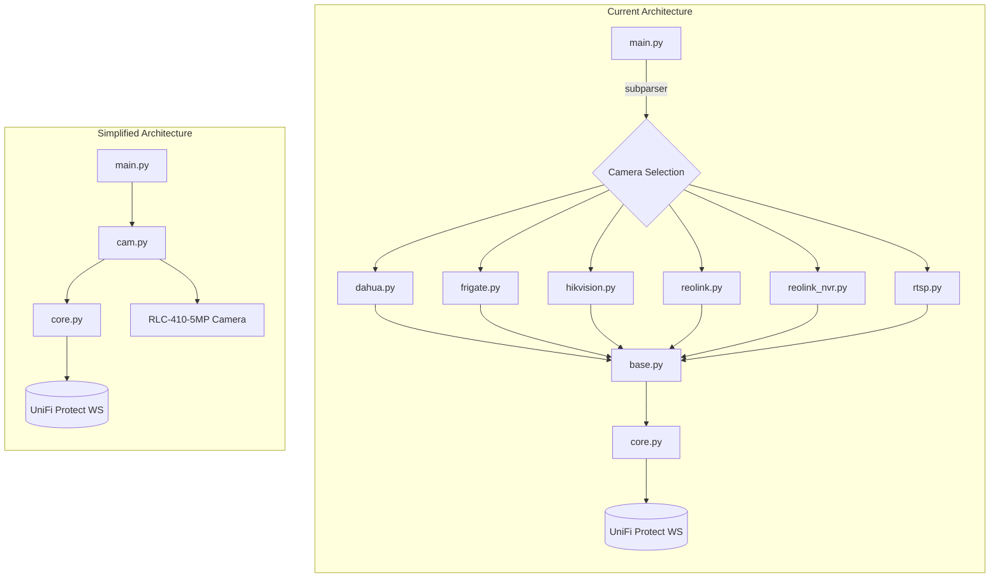

# Simplified Architecture Design for RLC-410-5MP Support

## Executive Summary

This document outlines a plan to simplify the `unifi-cam-proxy` project to support **only** the Reolink RLC-410-5MP camera. The current implementation supports 6+ camera brands with significant complexity. By focusing on a single camera model, we can reduce code complexity, dependencies, and potential failure points.

---

## Current Architecture Overview

### Project Structure

```
unifi-cam-proxy/
├── unifi/
│   ├── __init__.py
│   ├── main.py           # Entry point with camera selection
│   ├── core.py           # WebSocket connection management
│   ├── clock_sync.py     # FLV timestamp synchronization
│   ├── version.py        # Version tracking
│   └── cams/
│       ├── __init__.py
│       ├── base.py       # Abstract base class (964 lines)
│       ├── dahua.py      # Dahua/Amcrest/Lorex support
│       ├── frigate.py    # Frigate NVR integration
│       ├── hikvision.py  # Hikvision support
│       ├── reolink.py    # Reolink camera (149 lines)
│       ├── reolink_nvr.py# Reolink NVR variant
│       └── rtsp.py       # Generic RTSP support
├── requirements.txt      # 14 dependencies
├── Dockerfile
└── docs/                 # Documentation for all camera types
```

### Key Components

#### 1. Entry Point ([`unifi/main.py`](unifi/main.py))
- Uses `argparse` with subparsers for camera selection
- Maintains `CAMS` dictionary mapping 8 aliases to 6 camera classes
- Imports all camera implementations
- Handles token generation via `pyunifiprotect`
- Preflight checks for `ffmpeg` and `nc` binaries

```python
CAMS = {
    "amcrest": DahuaCam,
    "dahua": DahuaCam,
    "frigate": FrigateCam,
    "hikvision": HikvisionCam,
    "lorex": DahuaCam,
    "reolink": Reolink,
    "reolink_nvr": ReolinkNVRCam,
    "rtsp": RTSPCam,
}
```

#### 2. Core Connection Manager ([`unifi/core.py`](unifi/core.py))
- Minimal WebSocket connection handler (82 lines)
- Manages connection to UniFi Protect on port 7442
- Exponential backoff reconnection using `backoff` library
- Delegates to camera class for stream and motion handling

#### 3. Base Camera Class ([`unifi/cams/base.py`](unifi/cams/base.py))
- Large abstract base class (964 lines)
- Implements UniFi Protect protocol:
  - WebSocket message processing
  - Video stream management via ffmpeg
  - Motion event handling
  - Snapshot capture/upload
  - ISP/device/OSD/network settings
  - Firmware upgrade simulation
- Abstract methods: `get_snapshot()`, `get_stream_source()`
- Optional overrides: `run()`, `get_video_settings()`, `get_feature_flags()`

#### 4. Reolink Implementation ([`unifi/cams/reolink.py`](unifi/cams/reolink.py))
- Extends `UnifiCamBase` (149 lines)
- Uses `reolinkapi` library for camera API
- Features:
  - Fetches frame rate info from camera
  - Builds RTSP URLs: `rtsp://user:pass@ip:554/Preview_01_main`
  - Polls motion state via HTTP API (`GetMdState`)
  - Custom ffmpeg args for H264 metadata timing

### Current Dependencies

| Dependency | Used By | Required for RLC-410-5MP |
|------------|---------|--------------------------|
| aiohttp | All cameras | **Yes** |
| amcrest | DahuaCam | No |
| asyncio-mqtt | FrigateCam | No |
| backoff | Core | **Yes** |
| coloredlogs | Main | **Yes** |
| flvlib3 | Base | **Yes** |
| hikvisionapi | HikvisionCam | No |
| semver | - | Maybe |
| packaging | Base | **Yes** |
| pydantic | pyunifiprotect | **Yes** |
| pyunifiprotect | Token generation | **Yes** |
| reolinkapi | Reolink | **Yes** |
| websockets | Core | **Yes** |
| xmltodict | HikvisionCam | No |

---

## Proposed Simplified Architecture

### New Project Structure

```
unifi-cam-proxy/
├── unifi/
│   ├── __init__.py
│   ├── main.py           # Simplified entry point
│   ├── core.py           # Unchanged
│   ├── clock_sync.py     # Unchanged
│   ├── version.py        # Unchanged
│   └── cam.py            # Merged: base.py + reolink.py (RLC-410-5MP specific)
├── requirements.txt      # Reduced to 9 dependencies
├── Dockerfile            # Unchanged
└── README.md             # Updated for RLC-410-5MP only
```

### Files to Remove

| File | Reason |
|------|--------|
| `unifi/cams/dahua.py` | Not needed for Reolink |
| `unifi/cams/frigate.py` | Not needed for Reolink |
| `unifi/cams/hikvision.py` | Not needed for Reolink |
| `unifi/cams/reolink_nvr.py` | Not needed for single cam |
| `unifi/cams/rtsp.py` | Not needed for Reolink |
| `unifi/cams/__init__.py` | No longer needed |
| `docs/` directory | Simplify documentation |

### Dependencies to Remove

```diff
  aiohttp
- amcrest
- asyncio-mqtt
  backoff
  coloredlogs
  flvlib3@https://github.com/zkonge/flvlib3/archive/master.zip
- hikvisionapi>=0.3.2
- semver
  packaging
  pydantic<2.0
  pyunifiprotect @ https://github.com/bdraco/pyunifiprotect/archive/refs/heads/master.zip
  reolinkapi
  websockets>=9.0.1,<13.0
- xmltodict
```

### Simplified Entry Point

The new [`main.py`](unifi/main.py) would be simplified:

```python
# Before: Multiple camera imports
from unifi.cams import (
    DahuaCam, FrigateCam, HikvisionCam,
    Reolink, ReolinkNVRCam, RTSPCam,
)

# After: Single camera import
from unifi.cam import ReolinkRLC410

# Before: Subparser selection
sp = parser.add_subparsers(dest="impl", required=True)
for name, impl in CAMS.items():
    subparser = sp.add_parser(name)
    impl.add_parser(subparser)

# After: Direct argument parsing
ReolinkRLC410.add_parser(parser)
```

### Merged Camera Module

Create a single [`unifi/cam.py`](unifi/cam.py) that:

1. Contains essential base class functionality (protocol handling)
2. Has RLC-410-5MP specific implementation inline
3. Removes abstraction layers

```python
# Proposed structure
class ReolinkRLC410:
    """
    UniFi Camera Proxy for Reolink RLC-410-5MP
    
    - RTSP streams: Preview_01_main, Preview_01_sub
    - Motion detection via HTTP API polling
    - Snapshot via HTTP API
    """
    
    # Combine base protocol handling + Reolink specifics
    # Remove abstract methods - everything is concrete
```

---

## Architecture Diagram



---

## Key Components to Keep

### 1. Core Connection Logic ([`unifi/core.py`](unifi/core.py))
- Keep unchanged - handles WebSocket connection to UniFi Protect
- Exponential backoff reconnection
- SSL certificate handling

### 2. Clock Sync ([`unifi/clock_sync.py`](unifi/clock_sync.py))
- Keep unchanged - handles FLV timestamp synchronization
- Required for proper video playback in UniFi Protect

### 3. Protocol Implementation (from [`base.py`](unifi/cams/base.py))
Keep these message handlers:
- `init_adoption()` - Camera adoption handshake
- `process_hello()` - Version negotiation
- `process_param_agreement()` - Parameter setup
- `process_video_settings()` - Stream configuration
- `process_isp_settings()` - ISP parameters
- `process_device_settings()` - Device info
- `process_snapshot_request()` - Snapshot upload
- `process_motion()` - Motion events

### 4. Reolink-Specific Features (from [`reolink.py`](unifi/cams/reolink.py))
- RTSP stream URL generation
- Motion detection polling
- Snapshot capture
- Frame rate detection

---

## RLC-410-5MP Specific Configuration

### Stream URLs
```
Main Stream: rtsp://user:pass@ip:554/Preview_01_main
Sub Stream:  rtsp://user:pass@ip:554/Preview_01_sub
```

### API Endpoints
```
Snapshot: http://ip/cgi-bin/api.cgi?cmd=Snap&channel=0&user=X&password=Y
Motion:   http://ip/api.cgi?cmd=GetMdState&user=X&password=Y
```

### Default Parameters
| Parameter | Value |
|-----------|-------|
| Channel | 0 |
| Main Stream FPS | 15-30 (detected via API) |
| Sub Stream FPS | 15-30 (detected via API) |
| Resolution | 2560x1920 (5MP) |

---

## Questions for Clarification

Before implementation, please confirm:

1. **Motion Detection**: Should we keep the HTTP polling approach for motion detection, or is there a preferred method?

2. **Smart Detection**: Does the RLC-410-5MP support person/vehicle detection that should be integrated?

3. **Audio Support**: Is audio streaming required? The RLC-410-5MP has a microphone but current implementation may not fully utilize it.

4. **PTZ Support**: The RLC-410-5MP is a fixed camera, so PTZ can be removed - correct?

5. **Multiple Cameras**: Should the simplified version support running multiple instances for multiple RLC-410-5MP cameras, or is this for a single camera setup?

6. **Docker Environment Variables**: Should we simplify the Docker entrypoint to only support Reolink-specific environment variables?

7. **Token Generation**: Keep the automatic token generation via `pyunifiprotect`, or require manual token specification?

---

## Implementation Steps

### Phase 1: Remove Unused Code
- [ ] Delete unused camera implementations (dahua.py, frigate.py, hikvision.py, reolink_nvr.py, rtsp.py)
- [ ] Remove `unifi/cams/` directory structure
- [ ] Update imports in `main.py`

### Phase 2: Consolidate Camera Code
- [ ] Create `unifi/cam.py` merging `base.py` and `reolink.py`
- [ ] Remove abstract base class patterns
- [ ] Inline RLC-410-5MP specific configuration

### Phase 3: Simplify Dependencies
- [ ] Update `requirements.txt` to remove unused dependencies
- [ ] Test that remaining dependencies work correctly

### Phase 4: Update Configuration
- [ ] Simplify command-line arguments
- [ ] Update Docker entrypoint
- [ ] Update documentation

### Phase 5: Testing
- [ ] Test adoption with UniFi Protect
- [ ] Verify video streaming works
- [ ] Verify motion detection works
- [ ] Verify snapshot capture works

---

## Expected Benefits

| Metric | Before | After | Reduction |
|--------|--------|-------|-----------|
| Camera implementations | 6 | 1 | 83% |
| Python files in cams/ | 7 | 1 (merged) | 86% |
| Dependencies | 14 | 9 | 36% |
| Lines of code (cams) | ~1,500 | ~400 | 73% |
| Supported cameras | 8 aliases | 1 model | N/A |

---

## Risk Assessment

| Risk | Likelihood | Impact | Mitigation |
|------|------------|--------|------------|
| Missing protocol features | Low | Medium | Keep comprehensive base implementation |
| Reolink API changes | Low | High | Pin reolinkapi version |
| UniFi Protect updates | Medium | High | Monitor UniFi firmware changes |
| Regression in core features | Low | High | Test thoroughly before deployment |

---

## Conclusion

This simplification will result in a cleaner, more maintainable codebase focused solely on the RLC-410-5MP camera. The reduction in code complexity should help address the current issues by removing potential failure points from unused camera implementations.
